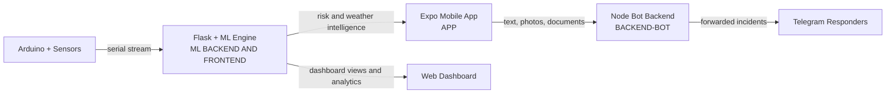

# Alpha Earth: Intelligent Emergency and Weather Intelligence Platform

A full-stack safety platform that combines:
- A mobile-first Expo app for emergency workflows, scanning, alerts, and operational modules
- A Node.js bot backend that forwards user media/text to Telegram responders
- A Python + Flask + ML weather intelligence backend connected to Arduino IoT sensors

This repository is organized as a multi-project workspace with three major systems working together.

## Table of Contents

- [Project Modules](#project-modules)
- [System Architecture](#system-architecture)
- [End-to-End Setup](#end-to-end-setup)
- [Data and Model Lifecycle](#data-and-model-lifecycle)
- [API Quick Reference](#api-quick-reference)
- [Folder Overview](#folder-overview)
- [Deployment Notes](#deployment-notes)
- [Known Gaps and Recommendations](#known-gaps-and-recommendations)
- [Team](#team)
- [License](#license)

## Architecture at a Glance

## Project Modules

### 1) APP (Expo + React Native + TypeScript)
Path: APP/

Purpose:
- User-facing emergency and operations experience
- Risk-aware UI with location and weather context
- Scanning, notifications, forecasting, profile, audit, and IoT module entry points

Core stack:
- Expo SDK 54
- React Native 0.81
- TypeScript
- Expo Router
- MQTT client, map/chart libraries, camera, notifications, sensors, location

Main scripts:
- npm run start
- npm run android
- npm run ios
- npm run web
- npm run lint
- npm run generate:screens

Key route files:
- app/(tabs)/index.tsx
- app/(tabs)/DashboardScreen.tsx
- app/(tabs)/EmergencyScreen.tsx
- app/(tabs)/ScannerScreen.tsx
- app/emergency.tsx
- app/forecasting.tsx
- app/iot-network.tsx
- app/detect.tsx
- app/scanner.tsx
- app/notifications.tsx
- app/profile.tsx
- app/audit.tsx

State and context:
- contexts/AlertContext.tsx
- contexts/RiskContext.tsx
- contexts/SensorContext.tsx
- contexts/ThemeContext.tsx

---

### 2) BACKEND-BOT (Node.js + Express)
Path: BACKEND-BOT/

Purpose:
- Receives user text/media from the app
- Forwards payloads to Telegram bot/chat
- Stores in-memory message history for each user
- Accepts Telegram webhook replies from experts/responders

Core stack:
- Node.js 18+
- Express
- Multer
- Axios
- dotenv

Main script:
- npm start

Primary endpoints:
- POST /send
- POST /send-photo
- POST /send-document
- POST /telegram-webhook
- GET /messages/:userId
- GET /health
- GET /set-webhook

Environment variables:
- PORT=3000
- TELEGRAM_BOT_TOKEN=your_bot_token
- TELEGRAM_CHAT_ID=your_chat_id

Notes:
- Uploads are temporarily stored in uploads/
- Media is forwarded to Telegram and then removed from disk
- Message storage is in-memory (non-persistent)

---

### 3) ML BACKEND AND FRONTEND (Python + Flask + Scikit-learn + Arduino)
Path: ML BACKEND AND FRONTEND/

Purpose:
- Reads real-time sensor values from Arduino
- Performs current weather classification and short-horizon forecasting
- Serves a web dashboard with monitoring views and model analysis
- Logs weather data for retraining and month-wise analytics

Core stack:
- Python 3.11+
- Flask
- NumPy, Pandas, scikit-learn, joblib
- PySerial

Key capabilities:
- Auto-detect Arduino serial port
- Sensor smoothing with moving average
- Prediction stabilization with majority voting
- Multi-model comparison (Decision Tree, Gradient Boosting, KNN, Random Forest)
- WeatherAPI integration for ground-truth comparison

Primary routes (Flask):
- GET /
- GET /pressure
- GET /temp_humidity
- GET /precipitation
- GET /uv_index
- GET /prediction
- GET /model_analysis
- GET /data
- GET /model_info
- POST /start_monitoring
- POST /stop_monitoring
- POST /set_mode
- POST /clear_data

Default runtime:
- Host: 0.0.0.0
- Port: 5000

Main scripts:
- python app.py
- python train_model.py
- python train_forecast.py
- python build_forecast_dataset.py

Important files:
- app.py
- train_model.py
- train_forecast.py
- build_forecast_dataset.py
- weather_classification_data.csv
- forecast_dataset.csv
- models/model_accuracies.json

## System Architecture

1. Mobile users interact with emergency and operations workflows in APP/.
2. Critical messages, photos, and documents are sent to BACKEND-BOT/.
3. BACKEND-BOT/ forwards events to Telegram responder channels.
4. IoT weather sensing and ML predictions run in ML BACKEND AND FRONTEND/.
5. APP/ can consume weather/risk context while responders coordinate through Telegram.

## End-to-End Setup

## Prerequisites
- Node.js 18+
- npm 9+
- Python 3.11+
- pip
- Arduino board and sensors (for live IoT mode)

## 1) Run Mobile App (APP)

1. Open terminal in APP/
2. Install dependencies:
   - npm install
3. Start Expo:
   - npm run start
4. Optional targets:
   - npm run android
   - npm run ios
   - npm run web

Optional env for app-side AI key:
- EXPO_PUBLIC_GROQ_API_KEY=your_key_here

## 2) Run Telegram Backend (BACKEND-BOT)

1. Open terminal in BACKEND-BOT/
2. Install dependencies:
   - npm install
3. Create .env with:
   - PORT=3000
   - TELEGRAM_BOT_TOKEN=...
   - TELEGRAM_CHAT_ID=...
4. Start service:
   - npm start
5. Verify health:
   - GET http://localhost:3000/health

## 3) Run Weather ML Backend (ML BACKEND AND FRONTEND)

1. Open terminal in ML BACKEND AND FRONTEND/
2. Create and activate virtual environment (recommended)
3. Install dependencies:
   - pip install flask numpy pandas scikit-learn joblib pyserial
4. Train models (first run):
   - python train_model.py
   - python build_forecast_dataset.py
   - python train_forecast.py
5. Start Flask app:
   - python app.py
6. Open dashboard:
   - http://localhost:5000

## Data and Model Lifecycle

Training:
- weather_classification_data.csv is used for current weather model
- forecast datasets are built and used for forecast model training

Inference:
- Live sensor stream -> validation -> smoothing -> feature engineering -> scaling -> model prediction -> stabilized output

Logging:
- Weather logs are stored in CSV files and can be reused for retraining

## API Quick Reference

### BACKEND-BOT
- POST /send
  - Body: userId, text
- POST /send-photo
  - Form-data: userId, photo, caption (optional)
- POST /send-document
  - Form-data: userId, document, caption (optional)
- GET /messages/:userId
- GET /health
- POST /telegram-webhook

### ML BACKEND
- GET /data
  - Returns current sensor values, prediction states, and historical buffers
- GET /model_info
  - Returns model architecture metadata and feature importances
- POST /start_monitoring
  - Starts monitoring session with selected Arduino port/duration
- POST /stop_monitoring
- POST /set_mode
  - Switches between real and simulation mode
- POST /clear_data

## Folder Overview

- APP/ -> Expo mobile app
- BACKEND-BOT/ -> Telegram bridge backend
- ML BACKEND AND FRONTEND/ -> Flask IoT + ML dashboard and training pipeline

## Deployment Notes

APP:
- Use EAS for build/deploy (eas.json present)

BACKEND-BOT:
- Suitable for deployment on Render or similar Node hosts
- Configure TELEGRAM_BOT_TOKEN and TELEGRAM_CHAT_ID in host environment

ML BACKEND:
- Can run under gunicorn in production
- Ensure models directory is present and writable paths for logging exist
- Expose Flask port and serial access only where needed

## Known Gaps and Recommendations

1. APP/package.json currently contains an invalid dependency entry:
   - "undefined": "socket.io-client\\"
   Remove or correct this to avoid install/build issues.
2. BACKEND-BOT message store is in-memory only; add persistent storage (SQLite/Postgres) for production.
3. Some API keys and defaults are hardcoded in code; move all secrets to environment variables.
4. Add a root-level .env.example for APP, BACKEND-BOT, and ML BACKEND configs.
5. Add integration tests for bot endpoints and Flask monitoring flow.

## Team

Contributors mentioned in module docs:
- Rehan Suman
- Mehul Patwari
- Ayush Patwari

## License

The APP module README marks the project as Proprietary.
If you plan distribution, add a single authoritative LICENSE file at repository root.

---

If you want, I can next generate:
1) A polished .env.example pack for all three modules
2) A docker-compose setup to run BACKEND-BOT + ML BACKEND together
3) A concise contributor/developer onboarding guide# MINI-PROJECT-

